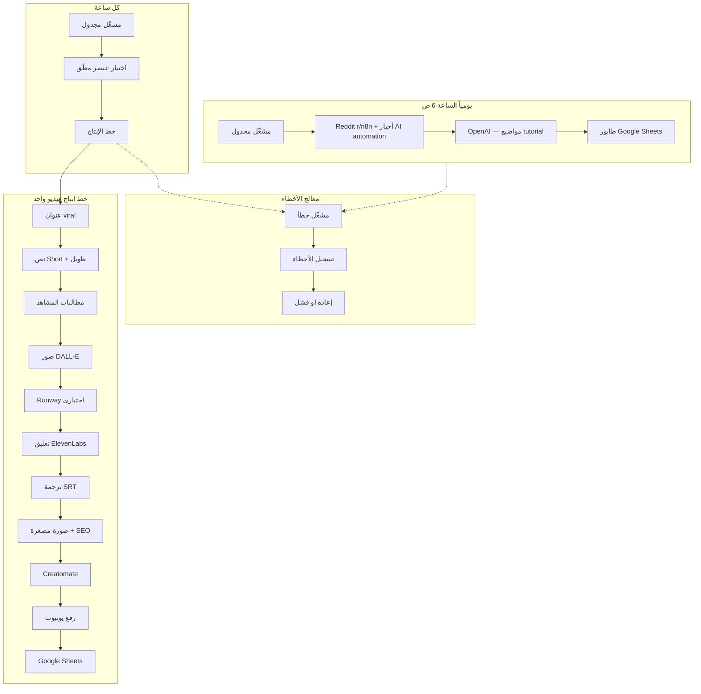

# نظام أتمتة يوتيوب — AI Workflow & Automation for Business

خط إنتاج يوتيوب **آلي بالكامل** لقنوات **تعليم الأتمتة وAI للأعمال** (Make.com, n8n, Zapier, no-code). يكتشف المواضيع، يولّد سكربتات tutorial، مشاهد tech، يرender عبر Creatomate، يرفع إلى يوتيوب، ويسجّل في Google Sheets — حتى **20 فيديو يومياً**.

## البنية المعمارية



## سير العمل (Workflows)

| الملف | الغرض | الجدولة |
|-------|-------|---------|
| `workflows/01-daily-topic-discovery.json` | إيجاد 20 موضوع أتمتة/AI رائج وكتابتهم في الطابور | يومياً 6:00 ص |
| `workflows/02-video-production-pipeline.json` | إنتاج فيديو كامل لعنصر واحد | كل ساعة |
| `workflows/03-error-handler-logging.json` | تسجيل الأخطاء، إعادة حتى 3 مرات، وضع علامة فشل | عند حدوث خطأ |

## البدء السريع

### 1. المتطلبات

- [n8n](https://n8n.io) (يُفضّل self-hosted لـ 20 فيديو/يوم)
- مفتاح OpenAI API (GPT-4o + DALL-E 3)
- مفتاح [ElevenLabs](https://elevenlabs.io) + معرّف الصوت
- مفتاح [Creatomate](https://creatomate.com) + قالبان
- مشروع Google Cloud (Sheets + YouTube OAuth)
- اختياري: مفتاح [Runway](https://runwayml.com) لمقاطع الفيديو بالذكاء الاصطناعي

### 2. إعداد Google Sheets

1. أنشئ جدولاً بأوراق: `Queue`، `Content`، `Errors`، `Logs`
2. استورد صف العناوين من:
   - `google-sheets/queue-template.csv`
   - `google-sheets/content-template.csv`
3. أضف عناوين Errors/Logs حسب `google-sheets/schema.md`
4. انسخ معرّف الجدول (Spreadsheet ID) من الرابط

### 3. قوالب Creatomate

1. في Creatomate، أنشئ قالبين من:
   - `templates/creatomate-short-template.json` (Short 1080×1920)
   - `templates/creatomate-long-template.json` (طويل 1920×1080)
2. أضف حقولاً ديناميكية: `voiceover_url`، `hook_text`، `captions_srt`، `thumbnail_url`، `scene_1_url` … `scene_12_url`
3. انسخ معرّفي القالبين

### 4. بيانات الاعتماد في n8n

| الاعتماد | النوع | ملاحظات |
|----------|-------|---------|
| OpenAI API Key | Header Auth | `Authorization: Bearer sk-...` |
| Google Sheets OAuth | Google Sheets OAuth2 | فعّل Sheets API |
| YouTube OAuth | YouTube OAuth2 | النطاق: `youtube.upload` |
| ElevenLabs | متغير بيئة | `ELEVENLABS_API_KEY` |
| Creatomate | متغير بيئة | `CREATOMATE_API_KEY` |

### 5. متغيرات البيئة

انسخ قيم `config/env.example` إلى n8n **Settings → Variables** (أو `.env` للاستضافة الذاتية):

```bash
GOOGLE_SHEETS_DOCUMENT_ID=your-sheet-id
CREATOMATE_SHORT_TEMPLATE_ID=...
CREATOMATE_LONG_TEMPLATE_ID=...
ELEVENLABS_VOICE_ID=21m00Tcm4TlvDq8ikWAM
VIDEOS_PER_DAY=20
BATCH_DELAY_MINUTES=72
```

### 6. استيراد سير العمل

1. استورد `03-error-handler-logging.json` أولاً ← انسخ معرّف سير العمل
2. استورد `01-daily-topic-discovery.json` و `02-video-production-pipeline.json`
3. عيّن `WORKFLOW_ERROR_HANDLER_ID` بمعرّف معالج الأخطاء
4. في إعدادات 01 و 02، عيّن **Error Workflow** إلى معالج الأخطاء
5. فعّل السيرات الثلاثة

### 7. الاختبار

1. شغّل **02 Video Production Pipeline** يدوياً مع صف اختبار في Queue (`status=pending`)
2. تحقق من ملء ورقة Content ونجاح الرفع إلى يوتيوب
3. فعّل الجدولة اليومية والساعية

## خطوات خط الإنتاج (15 متطلباً)

| # | المتطلب | التنفيذ |
|---|---------|---------|
| 1 | مواضيع tutorial أتمتة | Reddit r/n8n + Google News (AI automation) → OpenAI |
| 2 | عنوان viral | OpenAI JSON: `viral_title`، `hook_text` |
| 3 | نص Short 60 ثانية | OpenAI ~150 كلمة |
| 4 | نص طويل 10 دقائق | OpenAI ~1500 كلمة + فصول |
| 5 | مطالبات المشاهد | مصفوفة JSON من OpenAI |
| 6 | مولّدات فيديو AI | صور DALL-E + Runway Gen-3 اختياري |
| 7 | تعليق ElevenLabs | MP3 قصير + طويل عبر API |
| 8 | ترجمة تلقائية | SRT من توقيت الكلمات |
| 9 | مطالبة الصورة المصغرة | OpenAI + DALL-E 3 |
| 10 | بيانات SEO | عنوان، وصف، وسوم |
| 11 | render تلقائي | Creatomate API مع polling |
| 12 | رفع يوتيوب | عقدة n8n YouTube (Short + طويل) |
| 13 | Google Sheets | أوراق Queue، Content، Errors، Logs |
| 14 | أتمتة يومية | Cron: 6 ص اكتشاف + معالجة كل ساعة |
| 15 | معالجة الأخطاء | 3 إعادات، سير أخطاء، تسجيل في الجدول |

## قابلية التوسع (20 فيديو/يوم)

- **طابور**: 20 عنصراً مجدولاً بـ `BATCH_DELAY_MINUTES=72` (واحد كل ~72 دقيقة)
- **معالج ساعي**: يختار أول عنصر `pending` whose `scheduled_at` قد مضى
- **حدود المعدّل**: كل عقد HTTP تستخدم `retryOnFail: true`، `maxTries: 3`
- **n8n self-hosted**: وضع queue + عدة workers لإنتاجية أعلى
- **تقدير التكلفة** (لكل فيديو): ~$2–5 OpenAI + ~$0.30 ElevenLabs + Creatomate

لزيادة الإنتاجية: غيّر cron الساعي إلى `*/30 * * * *` وقلّل `BATCH_DELAY_MINUTES` إلى `36`.

## هيكل الملفات

```
n8n-youtube-automation/
├── config/env.example
├── google-sheets/
│   ├── schema.md
│   ├── queue-template.csv
│   └── content-template.csv
├── scripts/generate-production-workflow.py
├── templates/
│   ├── creatomate-short-template.json
│   └── creatomate-long-template.json
└── workflows/
    ├── 01-daily-topic-discovery.json
    ├── 02-video-production-pipeline.json
    └── 03-error-handler-logging.json
```

## التخصيص

- **المجال**: غيّر `CHANNEL_NICHE`
- **الصوت**: غيّر `ELEVENLABS_VOICE_ID`
- **خصوصية النشر**: `YOUTUBE_DEFAULT_PRIVACY=public|unlisted|private`
- **عدد المشاهد**: عدّل system prompt في عقدة `Generate Scene Prompts`
- **إعادة توليد سير العمل**: `py scripts/generate-production-workflow.py`

## استكشاف الأخطاء

| المشكلة | الحل |
|---------|------|
| لا تُعالَج عناصر الطابور | تحقق أن `scheduled_at` في الماضي و `status=pending` |
| فشل render Creatomate | تحقق من URLs عامة للتعليق الصوتي وصور المشاهد |
| رفع يوتيوب 403 | أعد تفويض OAuth؛ فعّل YouTube Data API v3 |
| حدود OpenAI | قلّل `VIDEOS_PER_DAY` أو أضف عقد Wait |
| فشل رفع tmpfiles.org | استبدل بـ S3/Cloudinary في عقدة `Upload Short Voiceover` |

## ملاحظات قانونية ومحتوى

- راجع النصوص المولّدة بالذكاء الاصطناعي قبل تفعيل الرفع `public` الآلي بالكامل
- تجنّب المحتوى التشهيري عن أشخاص أحياء
- افصح عن المحتوى المولّد بالذكاء الاصطناعي وفق سياسات يوتيوب
- احترم شروط Reddit وواجهات API
