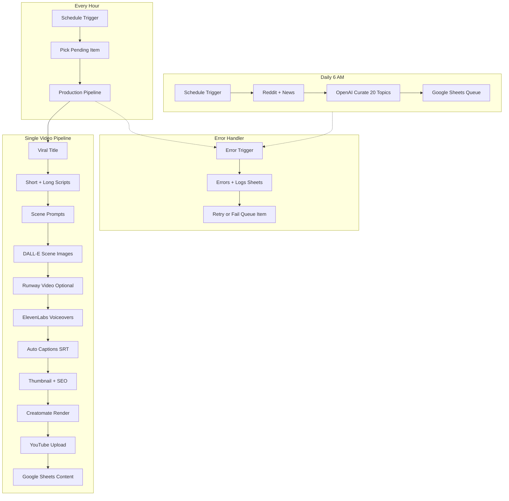

# n8n YouTube Automation — AI Workflow & Business

End-to-end, hands-off YouTube pipeline for **AI workflow automation** channels (Make.com, n8n, Zapier, no-code). Discovers tutorial topics, generates scripts and tech visuals, renders with Creatomate, uploads to YouTube, and logs everything to Google Sheets — up to **20 videos per day**.

## Architecture



## Workflows

| File | Purpose | Schedule |
|------|---------|----------|
| `workflows/01-daily-topic-discovery.json` | Find 20 trending automation tutorial topics, write to Queue | Daily 6:00 AM |
| `workflows/02-video-production-pipeline.json` | Full video production for one queue item | Every hour |
| `workflows/03-error-handler-logging.json` | Log errors, retry up to 3×, mark failed | On error |

## Quick Start

### 1. Prerequisites

- [n8n](https://n8n.io) (self-hosted recommended for 20 videos/day)
- OpenAI API key (GPT-4o + DALL-E 3)
- [ElevenLabs](https://elevenlabs.io) API key + voice ID
- [Creatomate](https://creatomate.com) API key + 2 templates
- Google Cloud project (Sheets + YouTube OAuth)
- Optional: [Runway](https://runwayml.com) API key for AI video clips

### 2. Google Sheets setup

1. Create a spreadsheet with tabs: `Queue`, `Content`, `Errors`, `Logs`
2. Import header rows from:
   - `google-sheets/queue-template.csv`
   - `google-sheets/content-template.csv`
3. Add Errors/Logs headers per `google-sheets/schema.md`
4. Copy the spreadsheet ID from the URL

### 3. Creatomate templates

1. In Creatomate, create two templates from:
   - `templates/creatomate-short-template.json` (1080×1920 Short)
   - `templates/creatomate-long-template.json` (1920×1080 long form)
2. Add dynamic fields: `voiceover_url`, `hook_text`, `captions_srt`, `thumbnail_url`, `scene_1_url` … `scene_12_url`
3. Copy both template IDs

### 4. n8n credentials

Create these credentials in n8n:

| Credential | Type | Header / Notes |
|------------|------|----------------|
| OpenAI API Key | Header Auth | `Authorization: Bearer sk-...` |
| Google Sheets OAuth | Google Sheets OAuth2 | Enable Sheets API |
| YouTube OAuth | YouTube OAuth2 | Scope: `youtube.upload` |
| ElevenLabs | Env var | `ELEVENLABS_API_KEY` |
| Creatomate | Env var | `CREATOMATE_API_KEY` |

### 5. Environment variables

Copy `config/env.example` values into n8n **Settings → Variables** (or `.env` for self-hosted):

```bash
GOOGLE_SHEETS_DOCUMENT_ID=your-sheet-id
CREATOMATE_SHORT_TEMPLATE_ID=...
CREATOMATE_LONG_TEMPLATE_ID=...
ELEVENLABS_VOICE_ID=21m00Tcm4TlvDq8ikWAM
VIDEOS_PER_DAY=20
BATCH_DELAY_MINUTES=72
```

### 6. Import workflows

1. Import `03-error-handler-logging.json` first → copy its workflow ID
2. Import `01-daily-topic-discovery.json` and `02-video-production-pipeline.json`
3. Set `WORKFLOW_ERROR_HANDLER_ID` to the error handler workflow ID
4. In workflow settings for 01 and 02, set **Error Workflow** to the error handler
5. Activate all three workflows

### 7. Test

1. Run **02 Video Production Pipeline** manually with a test row in Queue (`status=pending`)
2. Verify Content tab fills and YouTube uploads succeed
3. Enable daily + hourly schedules

## Pipeline Steps (15 Requirements)

| # | Requirement | Implementation |
|---|-------------|----------------|
| 1 | Trending automation tutorial topics | Reddit r/n8n + Google News (AI automation) → OpenAI curation |
| 2 | Viral title | OpenAI JSON: `viral_title`, `hook_text` |
| 3 | 60s Short script | OpenAI ~150 words |
| 4 | 10-min long script | OpenAI ~1500 words + chapters |
| 5 | Scene prompts | OpenAI JSON scenes array |
| 6 | AI video generators | DALL-E images + optional Runway Gen-3 |
| 7 | ElevenLabs voiceover | Short + long MP3 via API |
| 8 | Auto captions | SRT generated from short script (word-timing) |
| 9 | Thumbnail prompt | OpenAI + DALL-E 3 image |
| 10 | SEO metadata | OpenAI title, description, tags |
| 11 | Auto render | Creatomate API with poll |
| 12 | YouTube upload | n8n YouTube node (Short + long) |
| 13 | Google Sheets | Queue, Content, Errors, Logs tabs |
| 14 | Daily automation | Cron: 6 AM discovery + hourly processing |
| 15 | Error handling | Retries (3×), error workflow, sheet logging |

## Scalability (20 videos/day)

- **Queue-based**: 20 items scheduled with `BATCH_DELAY_MINUTES=72` (one every ~72 min)
- **Hourly processor**: Picks next `pending` item whose `scheduled_at` has passed
- **Rate limits**: All HTTP nodes use `retryOnFail: true`, `maxTries: 3`
- **Self-hosted n8n**: Use queue mode + multiple workers for higher throughput
- **Cost estimate** (per video): ~$2–5 OpenAI + ~$0.30 ElevenLabs + Creatomate renders

To increase throughput, change hourly cron to `*/30 * * * *` and reduce `BATCH_DELAY_MINUTES` to `36`.

## File Structure

```
n8n-youtube-automation/
├── config/env.example
├── google-sheets/
│   ├── schema.md
│   ├── queue-template.csv
│   └── content-template.csv
├── scripts/generate-production-workflow.py
├── templates/
│   ├── creatomate-short-template.json
│   └── creatomate-long-template.json
└── workflows/
    ├── 01-daily-topic-discovery.json
    ├── 02-video-production-pipeline.json
    └── 03-error-handler-logging.json
```

## Customization

- **Niche**: Change `CHANNEL_NICHE` env var
- **Voice**: Change `ELEVENLABS_VOICE_ID`
- **Publish privacy**: `YOUTUBE_DEFAULT_PRIVACY=public|unlisted|private`
- **Scene count**: Edit OpenAI system prompt in `Generate Scene Prompts` node
- **Regenerate workflow**: `py scripts/generate-production-workflow.py`

## Troubleshooting

| Issue | Fix |
|-------|-----|
| No queue items processed | Check `scheduled_at` is in the past and `status=pending` |
| Creatomate render fails | Verify public URLs for voiceover + scene images |
| YouTube upload 403 | Re-authorize OAuth; enable YouTube Data API v3 |
| OpenAI rate limits | Reduce `VIDEOS_PER_DAY` or add Wait nodes |
| tmpfiles.org upload fails | Replace with S3/Cloudinary in `Upload Short Voiceover` node |

## Legal & Content Notes

- Review AI-generated scripts before enabling fully automated `public` uploads
- Avoid defamatory content about living persons
- Disclose AI-generated content per YouTube policies
- Respect Reddit/API terms of service
